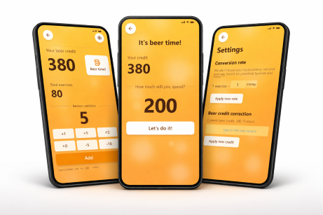
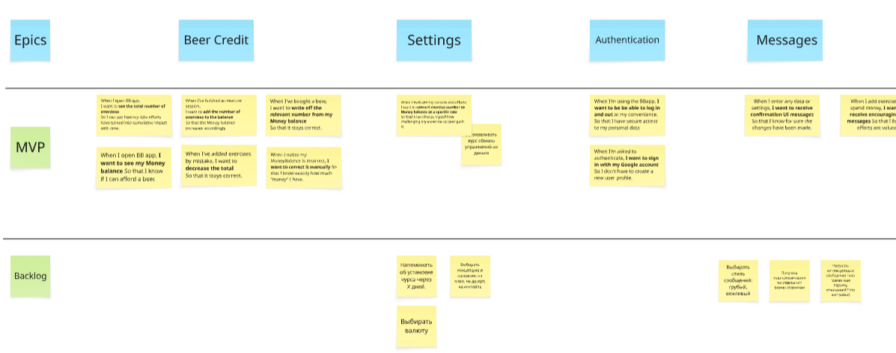
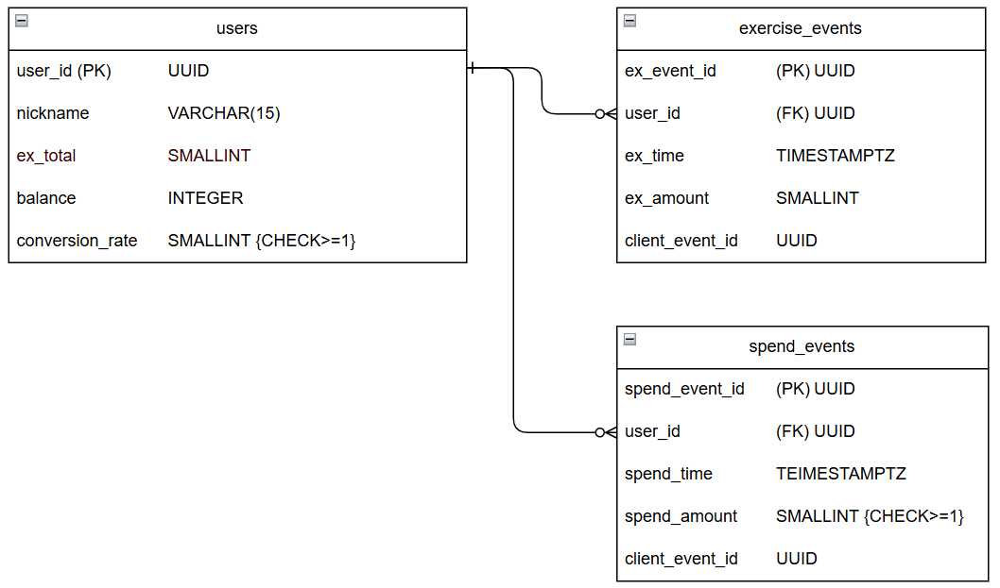

*By [Pavel Linitsky](https://www.linkedin.com/in/linitsky/)  ||*  *[Live app landing page](https://getbeerbank.vercel.app/)*

In this app-building project, I practiced: 

- Requirements management
- Database development (ER diagrams, Supabase)
- API endpoints (Swagger, Postman)
- Project documentation (Obsidian, Github, Markdown, Miro, DrawIO, Notion)
- AI vibe coding (VS Code, Cursor)

# Basic Project Info

## Product Overview

**BeerBank** **is a fun app for those who love beer** **and would like to improve their physical shape,** but lack the motivation for regular workouts. Through gamification, we encourage them to add simple exercises to their daily life so they start moving their asses, even if it’s only a little.

Download it from the landing page:
[getbeerbank.vercel.app](https://getbeerbank.vercel.app/)

## App Usage Scenario

**Step 1**: When I have a free minute, I do a few push-ups, squats, or other simple exercises. I add the number of repetitions to my BeerBank App, which increases my Beer Credit.

**Step 2**: When I want to buy a beer, I check my Beer Credit. If I have enough credit, I can buy a beer and decrease my Beer Credit accordingly. If I don’t have enough credit, I’m honest with myself and skip the beer. Next time, I make sure I do enough exercise in advance before going to a bar.

## General Agreements

- **PWA**: The app shall be a PWA application.
- **Single device per user**: For MVP, we assume the app has a single user with a single device, so multi-device conflicts are not expected.
- **Offline-first**: To ensure seamless user experience, the local app data is always precedent to server data.
- **Localization-ready** approach (all UI copy is stored separately; will be implemented after MVP).

## Project Glossary

- **Exercise** - Any single action, like one push-up or one squat.
- **Session** - A set of exercises done in a row and added to the app as a single number.
- **ExTotal** - The total amount of exercises done by the user over the whole app usage period.
- **Balance** - The current amount of money units available to user. Increased automatically when exercises are added. Note that "money" in BBapp does not refer to any specific currency; It is assumed that it represents the user's local currency.
- **Conversion Rate** - The coefficient used to convert added exercises to money:`Added Money = Added Exercises * Conversion Rate.`
Conversion rate is set by the user in accordance to how lazy ass they are. For example, 1 exercise = 5 money units.

---

# Requirements

## Job Story Map

- *Story map is a great tool to visually organize stories into epics and stages (only a part of map is shown).*
- *I used Job stories, not User stories :The app has only one user role, and the context of actions is more important than the user type.*

## Epics and Job stories

| **Epic** | **Job Story ID** | **Description** | **Stage** |
| --- | --- | --- | --- |
| Balance | BAL1 | When I open BB app, I want to **see the total number of exercises** So I can see how my little efforts have turned into cumulative impact with time. | MVP |
|  | BAL2 | When I've finished an exercise session, I want to **add the number of exercises to the balance** So that the Money balance increases accordingly. | MVP |
|  | BAL3 | When I've added exercises by mistake, I want to **decrease the total** So that it stays correct. | MVP |
|  | BAL4 | When I open BB app, I want to **see my Money balance** So that I know if I can afford a beer. | MVP |
|  | BAL5 | When I've bought a beer, I want to **write off the relevant number from my Money balance** So that it stays correct. | MVP |
|  | BAL6 | When I notice my Balance is incorrect, **I want to correct it manually** So that I know exactly how much "money" I have. | MVP |
| Messages | MES1 | When I enter any data or settings, **I want to receive confirmation UI messages** So that I know for sure the changes have been made. | MVP |
|  | MES2 | When I add exercises or spend money, **I want to receive encouraging messages** So that I feel my efforts are valued. | MVP |
| Settings | SET1 | When I evaluate my success and efforts, I want to **convert exercise number to Money balance at a specific rate** So that I can choose myself how challenging my excercise-to-beer path is. | MVP |
| Authentication | AUT1 | When I'm using the BBapp, **I want to be be able to log in and out** at my convenience, So that I have secure access to my personal data | MVP |
|  | AUT2 | When I'm asked to authenticate, **I want to sign in with my Google account** So I don't have to create a new user profile. | MVP |
| Sync | SYN1 | When I adjust ExTotal or Balance, **I want my adjustments to be reflected immediately** so that I instantly feel satisfied with my efforts and honesty. | MVP |
|  |  |  |  |

## Requirements

| **Req ID (Type-Story-No)** | **Description**                                                                                                                                                                                                                                               | **AC**                                                                                                                                                                                                                                                                                                                                                                                                                                                                                                                                                                                                                                                                                                                                                                                                                                                                                                                                                                                                                                                                                     |
| -------------------------- | ------------------------------------------------------------------------------------------------------------------------------------------------------------------------------------------------------------------------------------------------------------- | ------------------------------------------------------------------------------------------------------------------------------------------------------------------------------------------------------------------------------------------------------------------------------------------------------------------------------------------------------------------------------------------------------------------------------------------------------------------------------------------------------------------------------------------------------------------------------------------------------------------------------------------------------------------------------------------------------------------------------------------------------------------------------------------------------------------------------------------------------------------------------------------------------------------------------------------------------------------------------------------------------------------------------------------------------------------------------------------ |
|                            | **Functional requirements**                                                                                                                                                                                                                                   |                                                                                                                                                                                                                                                                                                                                                                                                                                                                                                                                                                                                                                                                                                                                                                                                                                                                                                                                                                                                                                                                                            |
|                            | **Authentication**                                                                                                                                                                                                                                            |                                                                                                                                                                                                                                                                                                                                                                                                                                                                                                                                                                                                                                                                                                                                                                                                                                                                                                                                                                                                                                                                                            |
| FR-AUT1.01                 | The app shall require user authentication to work.                                                                                                                                                                                                            | Given the user is not logged in, When the user opens the app, Then the authentication screen is displayed.                                                                                                                                                                                                                                                                                                                                                                                                                                                                                                                                                                                                                                                                                                                                                                                                                                                                                                                                                                                 |
| FR-AUT1.02                 | The app shall keep the user logged in until the user logs out on purpose.                                                                                                                                                                                     | Given the user has logged in, When the user re-opened the app, Then they are logged in without having to authenticate again.                                                                                                                                                                                                                                                                                                                                                                                                                                                                                                                                                                                                                                                                                                                                                                                                                                                                                                                                                               |
| FR-AUT2.03                 | The app shall allow users to authenticate using a Google account.                                                                                                                                                                                             | Given the user clicks "Login with Google", When the user successfully authenticated, Then the system logs the user in AND displays the main app screen.                                                                                                                                                                                                                                                                                                                                                                                                                                                                                                                                                                                                                                                                                                                                                                                                                                                                                                                                    |
| FR-AUT1.04                 | The app shall allow users to log out.                                                                                                                                                                                                                         | Given the user is logged in, When the user taps "Log out" button, Then they are redirected to the authentication screen.                                                                                                                                                                                                                                                                                                                                                                                                                                                                                                                                                                                                                                                                                                                                                                                                                                                                                                                                                                   |
|                            | **Main user operations**                                                                                                                                                                                                                                      |                                                                                                                                                                                                                                                                                                                                                                                                                                                                                                                                                                                                                                                                                                                                                                                                                                                                                                                                                                                                                                                                                            |
| FR-BAL1.01                 | The app shall display the total number of exercises (ExTotal) done by the user over the whole their usage history. UX: ExTotal shall be displayed on the Main screen.                                                                                      | **Given the user has recorded sessions**, When the main screen is open, Then ExTotal is displayed.    **Given the user has zero recorded sessions**, When the main screen is open, Then ExTotal is displayed as “0”.  **Given the app is offline**, When the main screen is open, Then locally stored ExTotal is displayed (according to other ACs).                                                                                                                                                                                                                                                                                                                                                                                                                                                                                                                                                                                                                                                                                                                        |
| FR-BAL1.02                 | The app shall display the values of recently added sessions.  UX: Recent sessions shall be displayed on the Main screen.                                                                                                                                   | **Given the user has recorded sessions**, When the main screen is open, Then 5 latest sessions' values are displayed (or less if there are less sessions recorded).    **Given the user has zero recorded sessions**, When the main screen is open, Then no recent sessions displayed.  **Given the app is offline**, When the main screen is open, Then locally stored Recent sessions' values are displayed (according to other ACs).                                                                                                                                                                                                                                                                                                                                                                                                                                                                                                                                                                                                                                        |
| FR-BAL4.01                 | The app shall display current Balance.  UX: Balance shall be displayed on the Main screen.                                                                                                                                                                 | **Given the user has Balance other than 0**, when the Main screen is open, Balance is displayed.   **Given the user’s Balance=0**, when the Main screen is open, Balance is displayed as “0”.     **Given the app is offline**, When the main screen is open, Then locally stored Balance is displayed (according to other ACs).                                                                                                                                                                                                                                                                                                                                                                                                                                                                                                                                                                                                                                                                                                                                               |
| FR-BAL2.01                 | The app shall allow adding exercise sessions, with the immediate changes to ExTotal and Balance (Delay: NFR-01)  UX: The user shall be able to add the number of exercises on the main screen.                                                             | **Given the user has set the number of exercises to add,** When they tap "Add", Then: a) ExTotal is updated by adding this number to the current ExTotal displayed;  b) The list of recent sessions' values is updated; c) Balance is updated by adding  `(number of added exercises)x(conversion rate)`;  e) "Add number of exercises" field is set to 0 and is ready for new input; d) Random MSG-ADD message is displayed.     **Given the user has set a negative number**, When they tap "Add", Then the event is processed as usual in steps a) - e) (with ExTotal and Balance decreased) AND no message is displayed.   **Given the user has set a negative number with modal value bigger than current local ExTotal**, When they tap "Add", Then the error message MSG-07 is displayed AND the input field stays as is.    (Example: Current ExTotal=5, the user sets "-6")  **Given the app is offline**, When the user adds exercises (as per other ACs), Then ExTotal and Balance are updated locally AND the event is queued for sync. |
| FR-BAL3.01                 | The app shall allow decreasing ExTotal by entering negative number of exercises. Balance shall be automatically decreased accordingly.    (Delay: NFR-01)                                                                                                  | See AC for FR-BAL2.01  Possible negative scenario (not covered in MVP):  The user added N exercises by mistake and got **N x rate** money to their Balance; then changed conversion rate. If they decrease the ExTotal now, their Balance decrease will not be accurate. We ignore this case for MVP.                                                                                                                                                                                                                                                                                                                                                                                                                                                                                                                                                                                                                                                                                                                                                                             |
| FR-SET1.01                 | The app shall allow setting a custom rate of converting the number of exercise to money. Default conversion rate is 1.  UX: Done on a “Settings” screen. Actual conversion rate is always displayed on the “Settings” screen.                           | **Given the “Settings” screen is open,** When the user typed in the conversion rate AND tapped "Apply new rate", Then: a) success message MSG-02 is displayed; b) all new conversions are performed according to the new rate.     **Given the user has never set custom Conversion Rate**, When a new session is added, Then default rate=1 is used to convert exercises to money.   **Given the user entered Conversion Rate other than a natural number** (1,2,3,etc.), Then the error message MSG-04 is displayed AND the conversion rate stays as before.  **Given the app is offline,** When the user has changed the conversion rate, Then the new rate is applied locally AND the change is queued for sync.                                                                                                                                                                                                                                                                                                                                                     |
| FR-SET1.02                 | The app shall suggest user setting conversion rate on first launch.                                                                                                                                                                                           | Given the user has logged in for the first time, When the user has been redirected from Auth screen to Main screen, Then the app displays a message suggesting to set a conversion rate.                                                                                                                                                                                                                                                                                                                                                                                                                                                                                                                                                                                                                                                                                                                                                                                                                                                                                                |
| FR-BAL5.01                 | The app shall allow writing off Balance by typing in the amount.  (Screen delay: NFR-01)   UX: Balance is written off by entering the write-off amount on a separate screen. Current Balance is displayed on SpendMoney screen.                   | **Given the Balance is >0 AND SpendMoney screen is open,** When the user enters the amount to write off AND taps “Spend”, Then: a) random MSG-SPEND message is displayed; b) Balance displayed is decreased by the write-off amount.      **Given the user entered the write-off amount other than a natural number** (1,2,3,etc.), When they tap "Spend", Then the error message MSG-04 is displayed AND the Balance stays as before; app stays waiting for correct input.    **Given the user entered the write-off amount that exceeds Balance**, When they tap "Spend", Then the error message MSG-03 is displayed AND the Balance stays as before; app stays waiting for correct input.  **Given the app is offline**, When the user has written off Balance, Then Balance is decreased locally AND the event is queued for sync.                                                                                                                                                                                                                                   |
| FR-BAL6.01                 | The app shall allow for manual Balance correction by typing in the new total amount.  (Screen delay: NFR-01)   UX: Balance correction is performed on a "Settings" screen.                                                                              | **Given the "Settings" screen is open**, When the user entered the new Balance AND tapped "Apply new balance", Then: a) success message MSG-01 is displayed; b) Newly entered Balance is displayed.     **Given the user entered the new Balance amount other than a natural number** (1,2,3,etc.) AND tapped "Apply new balance", Then the error message MSG-04 is displayed AND the Balance stays as before.  **Given the app is offline,** When the user has entered new Balance, Then Balance is updated locally AND the new value is queued for sync (not as an event, but as a direct value update).                                                                                                                                                                                                                                                                                                                                                                                                                                                                     |
|                            |                                                                                                                                                                                                                                                               |                                                                                                                                                                                                                                                                                                                                                                                                                                                                                                                                                                                                                                                                                                                                                                                                                                                                                                                                                                                                                                                                                            |
|                            | **Non-Functional requirements**                                                                                                                                                                                                                               |                                                                                                                                                                                                                                                                                                                                                                                                                                                                                                                                                                                                                                                                                                                                                                                                                                                                                                                                                                                                                                                                                            |
| NFR-01                     | **Balance display speed:** When the user has updated the exercise number OR Balance, Then ExTotal displayed and Balance displayed must be updated with a maximum delay of 500ms.                                                                           |                                                                                                                                                                                                                                                                                                                                                                                                                                                                                                                                                                                                                                                                                                                                                                                                                                                                                                                                                                                                                                                                                            |
| NFR-02                     | **Offline Mode:** The app shall be fully functional without a network connection. All user operations shall work offline. Data shall be synced with the server automatically when the connection is restored (no time limit to keep the local data).       |                                                                                                                                                                                                                                                                                                                                                                                                                                                                                                                                                                                                                                                                                                                                                                                                                                                                                                                                                                                                                                                                                            |
| NFR-03                     | **Sync Conflict:** If local (unsynced) data conflicts with server data, local app data shall always overwrite the server data upon sync. This refers to the user-initiated changes to ExTotal, Balance, Conversion rate, or any other data or settings. | Given the app has server data AND the user entered any data or settings in offline mode, When the server connection is restored, Then the server data is updated to match the local data.                                                                                                                                                                                                                                                                                                                                                                                                                                                                                                                                                                                                                                                                                                                                                                                                                                                                                                  |
| NFR-04                     | **Localization-Ready**: All UI strings, labels, and messages shall be stored in a dedicated localization file. Hard-coding UI text is not permitted. MVP supports Russian language only.                                                                   |                                                                                                                                                                                                                                                                                                                                                                                                                                                                                                                                                                                                                                                                                                                                                                                                                                                                                                                                                                                                                                                                                            |
|                            |                                                                                                                                                                                                                                                               |                                                                                                                                                                                                                                                                                                                                                                                                                                                                                                                                                                                                                                                                                                                                                                                                                                                                                                                                                                                                                                                                                            |

# Database Structure

## ER diagram

Created in Draw.IO

## Tables

- **User**: Stores core user data and cached totals.
- **ExerciseEvent**: Stores each exercise logging event for statistics and balance calculation.
- **SpendEvent**: Stores each spend event for statistics and balance calculation.

**users**

| Column | Type | Constraints | Description |
| --- | --- | --- | --- |
| user_id | UUID | PK, default gen_random_uuid() | Unique user ID |
| nickname | VARCHAR(15) | NOT NULL | Display name for future activities, like leaderboards (not in MVP) |
| ex_total | INTEGER | NOT NULL, default 0 | Cached total of all exercises logged |
| balance | INTEGER | NOT NULL, default 0 | Current beer credit balance |
| conversion_rate | SMALLINT | NOT NULL, default 1, CHECK >= 1 | Exercise-to-money conversion rate |

**exercise_events**

| Column | Type | Constraints | Description |
| --- | --- | --- | --- |
| ex_event_id | UUID | PK, default gen_random_uuid() | Unique event ID |
| user_id | UUID | FK → User.UserId, ON DELETE CASCADE | User ID |
| ex_time | TIMESTAMPTZ | NOT NULL, default now() | Timestamp of the session |
| ex_amount | SMALLINT | NOT NULL | Number of exercises |
| client_event_id | UUID | NOT NULL, UNIQUE | Client-generated ID for offline deduplication |

**spend_events**

| Column | Type | Constraints | Description |
| --- | --- | --- | --- |
| spend_event_id | UUID | PK, default gen_random_uuid() | Unique event ID |
| user_id | UUID | FK → User.UserId, ON DELETE CASCADE | User ID |
| spend_time | TIMESTAMPTZ | NOT NULL, default now() | Timestamp of the spend |
| spend_amount | SMALLINT | NOT NULL, CHECK >= 1 | Amount of money spent |
| client_event_id | UUID | NOT NULL, UNIQUE | Client-generated ID for offline deduplication |

---

# API Endpoints

- *Full API specification was created in Swagger.*
- *API integration is tested and fully functional (Postman / Supabase), yet not implemented in MVP.*

| Method | Path | Description | Requirement |
| --- | --- | --- | --- |
| GET | /users | Get current user data | FR-BAL1.01, FR-BAL4.01 |
| POST | /users | Create user on first login | FR-AUT1.01 |
| PATCH | /users | Update conversion rate or balance | FR-SET1-01, FR-BAL6.01 |
| POST | /exercise_events | Log an exercise session | FR-BAL2.01 |
| GET | /exercise_events | Get recent exercise sessions | FR-BAL1.01 |
| POST | /spend_events | Log a beer purchase | FR-BAL5.01 |
| GET | /spend_events | Get recent spend events | FR-BAL4.01 |
